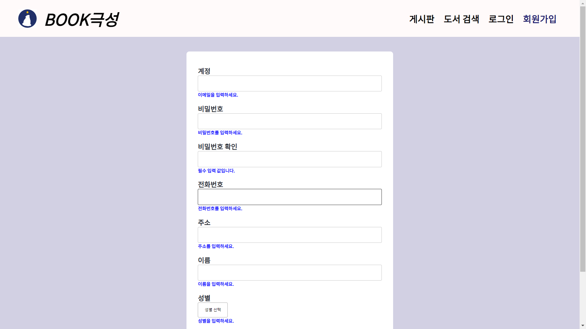
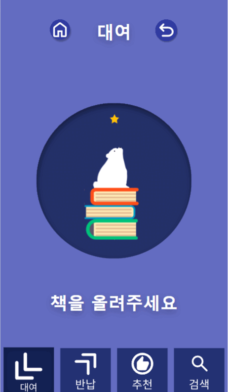
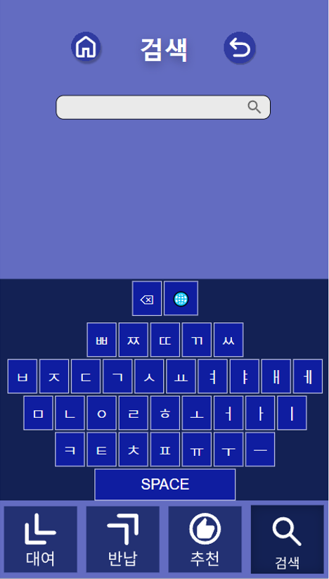
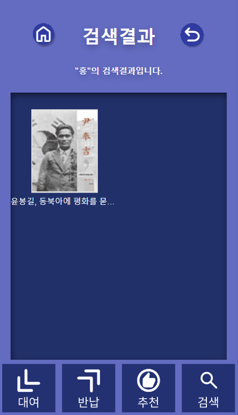
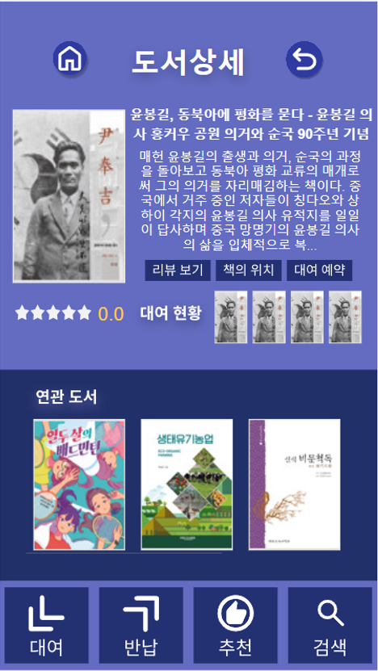
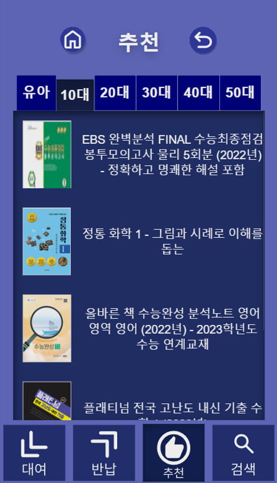
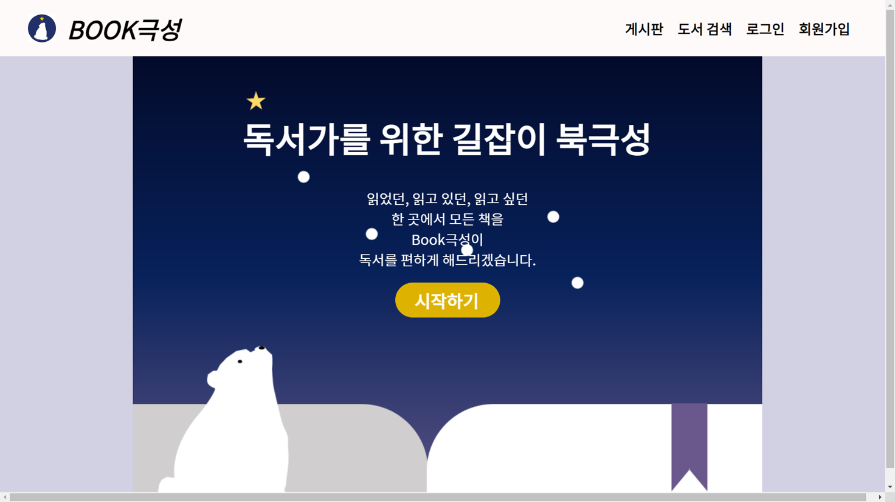
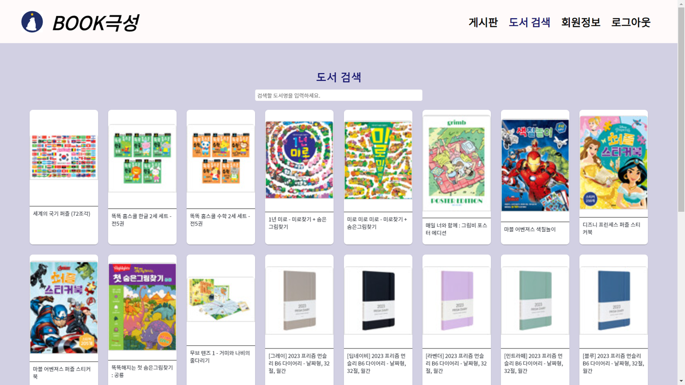
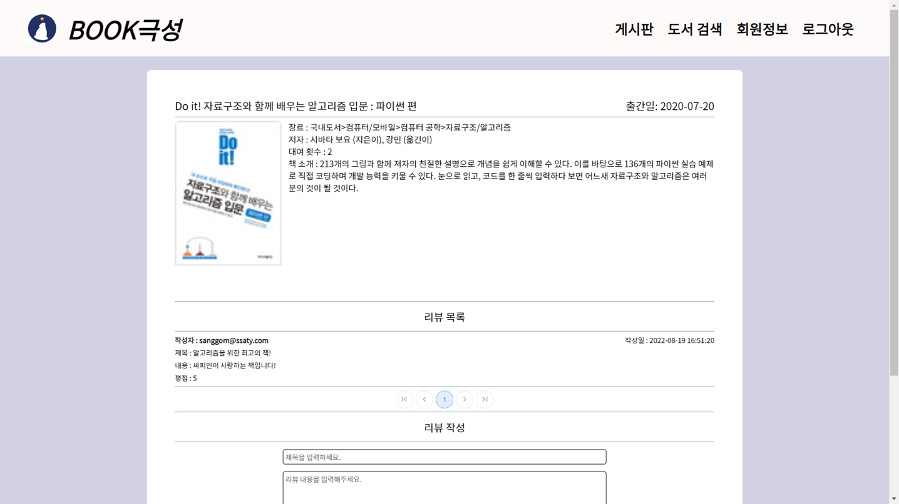
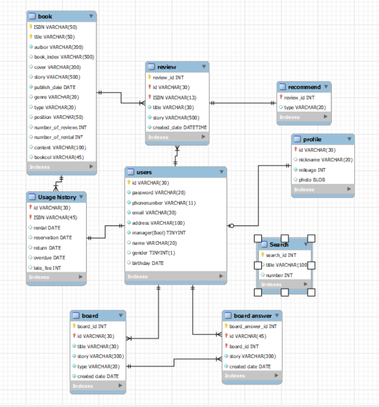

# Book극성 (원스톱 도서관 키오스크 서비스)
#### 프로젝트 진행 기간 : 2022-07-11 ~ 2022-08-19 (약 6주)

---

#### 목차

1. [기획 배경](#기획-배경)
2. [기능 소개](#기능-소개)
3. [주요 기술](#주요-기술)
4. [ERD](#ERD)
5. [협업 툴](#협업-툴)
6. [기여도](#기여도)
7. [UCC영상](https://youtu.be/CPgMSc54dAg) 

## 기획 배경

도서관에는 도서 대여 & 반납, 도서 검색, 도서 추천 등 여러 키오스크가 있습니다. 모두 도서관에서 필요한 기능들이지만, 여러 대로 분산되어있는 바람에 동선이 복잡해지거나 한쪽으로 사용자가 몰리는 등 비효율적인 사용성을 보이고 있습니다. 이 기능들을 한 키오스크에 모은다면 이용자의 편의성과 효율성이 증대되지 않을까 생각하여 'Book극성' 키오스크 서비스를 기획하게 되었습니다.

## 기능 소개

#### 키오스크 메인

- 키오스크 메인 페이지
- 회원가입 클릭 시 웹 페이지로 접근 가능한 QR코드가 제공됨
- 대여/반납/추천/검색 페이지로 접근 가능

#### 회원가입

 
- 회원 가입 웹 페이지

#### 도서 대여 & 반납

- NFC 태그를 이용해 대여될 책 & 회원정보 인식
- 읽어들인 정보를 socket.io 통신을 이용해 서버로 전송

#### 도서 검색

 
- 가상 키보드를 통한 화면 터치 검색 가능
- 검색어 자동완성 기능 제공

#### 도서 상세

 
- 다른 사용자들의 리뷰, 책의 위치, 대여 예약 기능 제공
- 데이터 유사도 기반 비슷한 장르의 연관 도서 추천

#### 도서 추천

- 감정추천과 연령대별 추천으로 나뉘어짐

- 감정 추천의 경우 카메라로 먼저 사용자의 표정을 인식

- 라즈베리파이를 활용한 face api를 통해 인식한 표정을 분석해 감정을 도출

- 북극성의 회원인 경우 회원의 대여 기록과 리뷰 기록을 활용한 데이터 유사도 기반으로 보다 적합한 추천을 받을 수 있음

  

- 연령대별 추천의 경우 유아부터 50대에 이르는 각 연령대의 인기 도서를 모아 보여줌

#### 웹 페이지

- 웹 페이지 메인

- 웹 페이지 도서 검색

- 웹 페이지 도서 상세. 이 곳에서 리뷰 작성 가능. (키오스크에서 리뷰 작성은 불가)

## ERD

## 주요 기술

-   Server 
	- aws
	- ec2
	- ubuntu

-   Front_End

	- HTML5, CSS3, JavaScript(ES6)
	-   React - 18.2.0
	-   Material UI/core - 4.12.4
	-   YUP
	-   SCSS

-   Back_End
	-   Python 3.9
	-   Java 8
	-   Spring Boot 2.7.2

-   IDE
	-   Visual Studio Code - 1.69
	-   IntelliJ - 222.3345.47
	-   MySQL Workbench - 8.0.29

## 협업 툴

-    Git
-   Notion
-   JIRA
-   MatterMost
-   Webex
